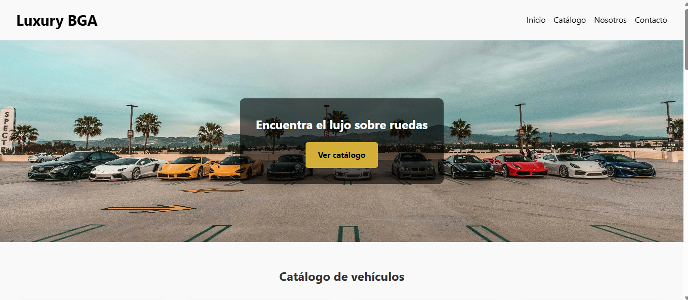

# 🚗 Luxury BGA

**Luxury BGA** es una plataforma web dedicada a la exhibición de vehículos de lujo, destacando las especificaciones técnicas de autos y motos de alto rendimiento. El sitio está diseñado para ofrecer una experiencia visual moderna, informativa e intuitiva.



---

## Características

- Catálogo de vehículos de lujo (autos y motos)
- Modal interactivo con especificaciones detalladas
- Formulario de contacto con feedback visual
- Navegación fluida con scroll suave y efecto en el header
- Diseño responsivo y atractivo

---

## Tecnologías utilizadas

- HTML5 + CSS3
- JavaScript (puro)
- Animaciones con CSS
- Estructura adaptable (responsive)

---

## Secciones del sitio

- **Inicio:** Imagen destacada con CTA al catálogo.
- **Catálogo:** Tarjetas interactivas de cada vehículo.
- **Nosotros:** Breve presentación de la marca y su misión.
- **Contacto:** Formulario funcional con validación.
- **Minijuego:** Minijuego interactivo.

---

## Cómo usar

1. Clona el repositorio:
   ```bash
   git clone https://github.com/tu-usuario/luxury-bga.git
